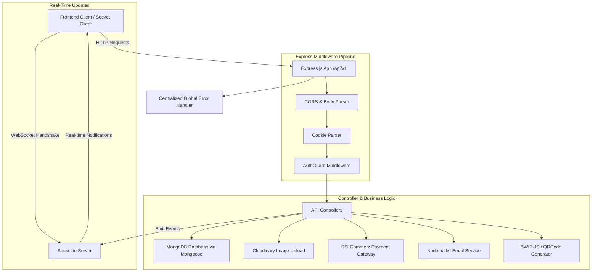

# 🛒 E-Commerce & Inventory Management REST API Backend

A production-ready, feature-rich RESTful API and real-time backend server built with **Node.js**, **Express.js (v5)**, **MongoDB**, and **Socket.io**. This application manages end-to-end e-commerce operations including user authentication, product catalog management, variants, discounts, coupons, shopping cart, order placement, SSLCommerz payment gateway integration, shipping/courier logistics, invoice generation, barcode/QR code processing, and real-time WebSocket notifications.

---

## 🛠️ Tech Stack & Dependencies (What I Use)

### Core Framework & Runtime
* **[Node.js](https://nodejs.org/)**: Asynchronous event-driven JavaScript runtime.
* **[Express.js (v5)](https://expressjs.com/)**: Fast, unopinionated, minimalist web framework for Node.js handling API routing (`/api/v1`).

### Database & Object Data Modeling (ODM)
* **[MongoDB](https://www.mongodb.com/)**: NoSQL document database for scalable data storage.
* **[Mongoose (v8)](https://mongoosejs.com/)**: Schema-based solution to model application data (Users, Products, Orders, Carts, etc.).

### Real-Time Communication
* **[Socket.io (v4)](https://socket.io/)**: Real-time bi-directional event-based communication server.
* **[Socket.io-client](https://socket.io/docs/v4/client-api/)**: Client library for testing and receiving real-time WebSocket events.

### Authentication & Security
* **[JSON Web Tokens (jsonwebtoken)](https://jwt.io/)**: Token-based authentication using Access Tokens and Refresh Tokens.
* **[Bcrypt](https://github.com/kelektiv/node.bcrypt.js)**: Password hashing library for storing secure credentials.
* **[Cookie-Parser](https://github.com/expressjs/cookie-parser)**: Middleware for parsing HTTP request cookies to handle secure HTTP-only Refresh Tokens.
* **[Cors](https://github.com/expressjs/cors)**: Cross-Origin Resource Sharing middleware enabling secure frontend-backend communication.

### Payment Gateway & Logistics
* **[SSLCommerz (sslcommerz-lts)](https://github.com/sslcommerz/SSLCommerz-Node.js)**: Official Bangladesh payment gateway integration supporting card, mobile banking (bKash/Nagad), and net banking payments.

### Media & Storage Integration
* **[Multer](https://github.com/expressjs/multer)**: Middleware for handling `multipart/form-data` image uploads.
* **[Cloudinary](https://cloudinary.com/)**: Cloud media management service for storing and serving optimized product images, brand assets, and user avatars.

### Utility & Generation Tools
* **[Nodemailer](https://nodemailer.com/)**: Email delivery service for sending verification OTPs, password reset emails, and order updates.
* **[bwip-js](https://github.com/metafloor/bwip-js)**: Barcode generator for product SKU/inventory tracking.
* **[QRCode](https://github.com/soldair/node-qrcode)**: QR Code generator for invoices and digital tracking.
* **[Slugify](https://github.com/simov/slugify)**: URL-friendly slug generator for product titles, categories, and brand names.
* **[Axios](https://axios-http.com/)**: Promise-based HTTP client for external service integration.
* **[Joi](https://joi.dev/)**: Schema description language and data validator for request payload validation.
* **[Dotenv](https://github.com/motdotla/dotenv)**: Module to load environment variables from `.env`.
* **[Nodemon](https://nodemon.io/)**: Utility that automatically restarts the node application when file changes are detected.

---

## ⚙️ System Architecture & How the System Works



### Step-by-Step System Execution Flow:

1. **Server Initialization (`index.js` & `app.js`)**:
   - `index.js` loads environment variables (`dotenv.config()`) and initiates the MongoDB database connection via `connectDatabase()`.
   - Once connected to MongoDB, the HTTP server (`httpServer`) starts listening on the defined `PORT` (default `4000`/`5000`).

2. **Middleware Pipeline Execution**:
   - `express.json()` converts incoming JSON payloads into JavaScript objects.
   - `express.urlencoded()` parses incoming URL-encoded form data.
   - `cookieParser()` parses request cookies to extract secure authentication refresh tokens.
   - `cors()` manages cross-origin permissions (configured for `http://localhost:5173` with `credentials: true`).

3. **Routing Matrix (`src/routes/index.api.js`)**:
   - All incoming HTTP requests to `/api/v1/*` are matched against designated sub-routers (e.g., `/auth`, `/product`, `/cart`, `/order`, `/payment`).

4. **Authentication & Security Flow (`authGuard.middleware.js`)**:
   - Secured endpoints execute the `authGuard` middleware.
   - The token is verified using `jsonwebtoken` (`ACCESS_TOKEN_SECRET`). If valid, user info is attached to `req.user`.

5. **Business Logic & Controller Layer**:
   - Controllers handle business rules, database queries via Mongoose models, price/discount calculations, stock checks, and response generation.
   - Standardized responses are returned using the `ApiResponse` utility.
   - Async operations are safely handled with `asyncHandler` wrappers.

6. **Payment Gateway Flow (SSLCommerz)**:
   - When placing an order with online payment, `Paymentgateway.controller.js` initializes an SSLCommerz session with transaction details.
   - SSLCommerz redirects the user to complete payment, hitting `/payment/success`, `/payment/fail`, or `/payment/cancel` callback routes upon completion.

7. **Real-Time WebSockets (`src/socket_io/server.js`)**:
   - `initSocket(httpServer)` attaches Socket.io to the HTTP server.
   - Clients connect passing `userId` via query parameter (`io("server_url", { query: { userId } })`).
   - The user joins a private Socket room matching their `userId`, allowing targeting real-time notifications (`getIo().to(userId).emit(...)`).

8. **Centralized Error Handling (`globalErrorHandler.js`)**:
   - Any runtime error or unhandled promise rejection is caught and processed by `globalErrorHandler`, returning a structured JSON error response without exposing server stack traces in production.

---

## 📂 Project Directory Structure

```text
├── .env.sample                 # Environment variable template
├── app.js                      # Express application setup, middlewares, routes & Socket initialization
├── index.js                    # Entry point: DB connection and HTTP server listener
├── package.json                # Dependencies and npm scripts
├── src/
│   ├── constants/              # System constants (e.g., DB name, user roles)
│   ├── controller/             # Business logic controllers
│   │   ├── Paymentgateway.controller.js
│   │   ├── brand.controller.js
│   │   ├── cart.controller.js
│   │   ├── category.controller.js
│   │   ├── coupon.controller.js
│   │   ├── courier.controller.js
│   │   ├── delivery.controller.js
│   │   ├── discount.controller.js
│   │   ├── order.controller.js
│   │   ├── product.controller.js
│   │   ├── review.controller.js
│   │   ├── subcategory.controller.js
│   │   ├── user.controller.js
│   │   └── variant-controller.js
│   ├── database/               # MongoDB configuration (`Db.config.js`)
│   ├── helpers/                # Helper utilities (Cloudinary, QR/Barcode, Axios, Unique ID)
│   ├── middleware/             # Express middlewares (`authGuard`, `multer`)
│   ├── models/                 # Mongoose schemas & data models (User, Product, Order, etc.)
│   ├── routes/                 # API routes breakdown
│   │   ├── index.api.js        # Main route router `/api/v1`
│   │   └── api/                # Sub-routes for each domain
│   ├── seeder/                 # Database seed scripts
│   ├── socket_io/              # Socket.io server initialization & client test script
│   │   ├── server.js           # Real-time WebSocket server logic
│   │   └── client.js           # Client Socket.io runner script
│   ├── template/               # Email & HTML templates
│   ├── utils/                  # Centralized utilities (`apiResponse`, `customError`, `globalErrorHandler`)
│   └── validation/             # Joi schema validation files
```

---

## 🔗 API Endpoint Matrix (`/api/v1`)

| Module | Route Prefix | Key Functions |
| :--- | :--- | :--- |
| **Auth & Users** | `/api/v1/auth` | User registration, login, token refresh, OTP verification, profile management |
| **Categories** | `/api/v1/category` | Create, fetch, update, delete main product categories |
| **Sub-Categories** | `/api/v1/subcategory` | Category sub-taxonomies management |
| **Brands** | `/api/v1/brand` | Brand entity management & logo updates |
| **Products** | `/api/v1/product` | Product CRUD, image uploads, barcode/QR generation, search & filter |
| **Product Variants** | `/api/v1/variant` | Size, color, SKU stock variants management |
| **Discounts** | `/api/v1/discount` | Promotional product discounts management |
| **Coupons** | `/api/v1/coupon` | Promo codes validation, expiration, and discount calculations |
| **Shopping Cart** | `/api/v1/cart` | Add to cart, update quantity, remove items, clear cart |
| **Delivery Charges** | `/api/v1/deliveryCharge` | Region-based delivery charge calculation |
| **Courier Logistics**| `/api/v1/courier` | Courier service setup & dispatch management |
| **Orders** | `/api/v1/order` | Place order, status tracking, invoice PDF/data generation, cancel order |
| **Payments** | `/api/v1/payment` | SSLCommerz payment initialization & IPN/callbacks (`/success`, `/fail`, `/cancel`) |
| **Reviews** | `/api/v1/review` | Product rating and customer feedback management |

---

## ⚡ Step-by-Step Installation & Running Guide

### 1. Prerequisites
Ensure you have the following installed on your machine:
* **Node.js** (v18.x or higher)
* **npm** or **yarn**
* **MongoDB** (Local instance or MongoDB Atlas cluster)

### 2. Clone the Repository
```bash
git clone <repository-url>
cd end
```

### 3. Install Dependencies
```bash
npm install
```

### 4. Configure Environment Variables
Create a `.env` file in the root directory by copying `.env.sample`:
```bash
cp .env.sample .env
```

Configure your `.env` parameters:
```env
PORT=4000
MONGODB_URL=mongodb+srv://<username>:<password>@cluster.mongodb.net
ACCESS_TOKEN_SECRET=your_access_token_secret_key
ACCESS_TOKEN_EXPIRE=1h
REFRESH_TOKEN_SECRET=your_refresh_token_secret_key
REFRESH_TOKEN_EXPIRE=15d

# Nodemailer Settings
HOST_MAIL=your_email@gmail.com
HOST_PASSWORD=your_app_password

# Cloudinary Credentials (if uploading media)
CLOUDINARY_CLOUD_NAME=your_cloud_name
CLOUDINARY_API_KEY=your_api_key
CLOUDINARY_API_SECRET=your_api_secret

# SSLCommerz Credentials (for payments)
STORE_ID=your_store_id
STORE_PASSWORD=your_store_password
IS_LIVE=false
```

### 5. Start the Application

#### Development Mode (With Auto-Reload):
```bash
npm run start
```
*or*
```bash
npm run dev
```

#### Running the Socket.io Client Test Script:
To test real-time WebSocket connection and events:
```bash
npm run socket
```

---

## ⚡ Socket.io Real-Time System Integration

The backend features a dedicated Socket.io instance. To connect a frontend or external client:

```javascript
import { io } from "socket.io-client";

// Connect to the backend socket server passing the user ID
const socket = io("http://localhost:4000", {
  query: { userId: "USER_MONGO_ID_HERE" }
});

socket.on("connect", () => {
  console.log("Connected to server with socket ID:", socket.id);
});

// Receive personalized notifications broadcasted to your private room
socket.on("notification", (data) => {
  console.log("Real-time notification received:", data);
});
```

---

## 📝 License
This project is licensed under the **ISC License**.
